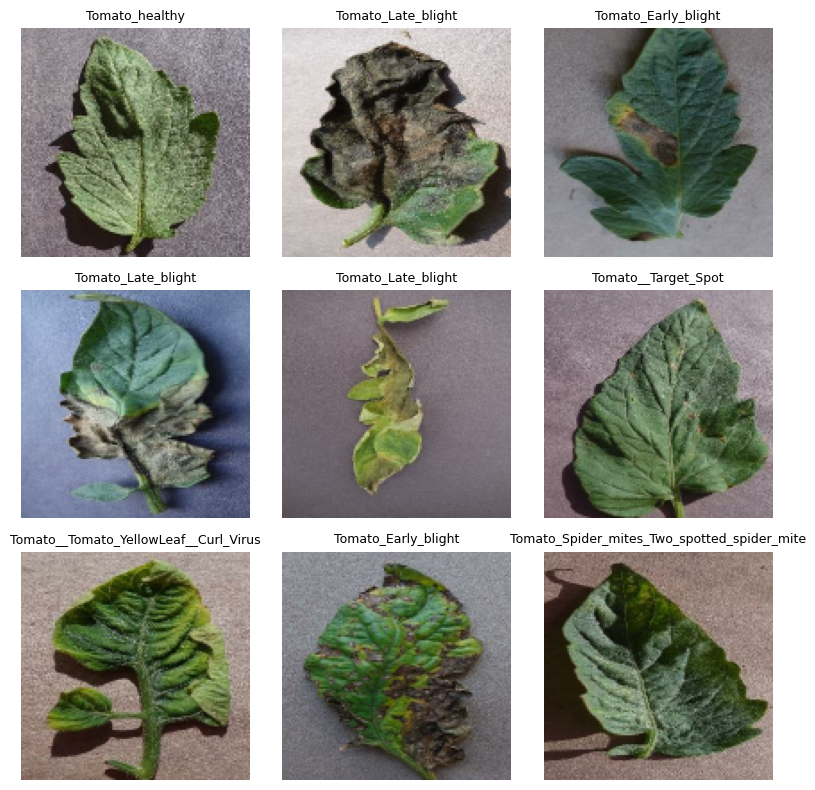
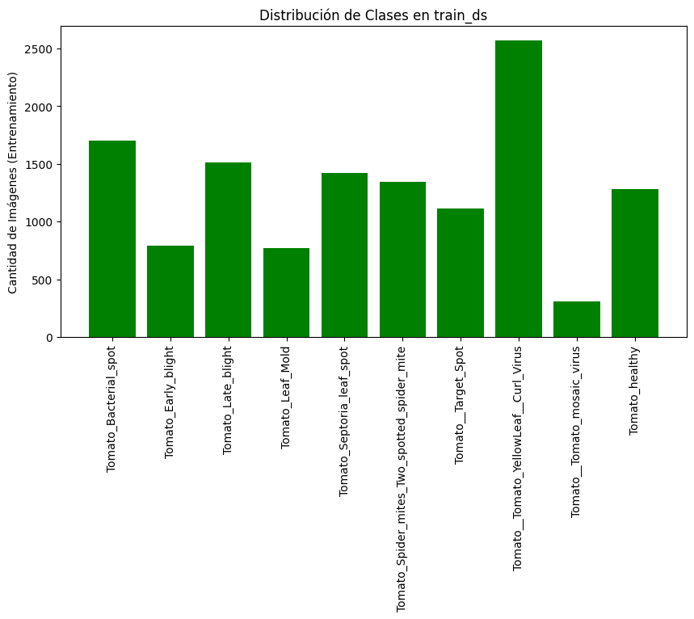
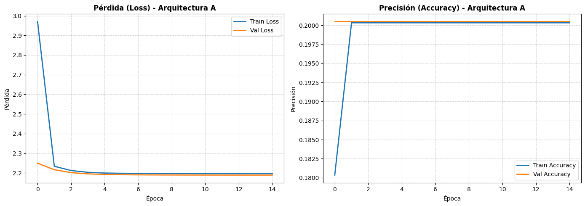
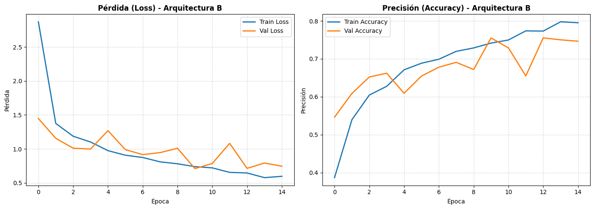
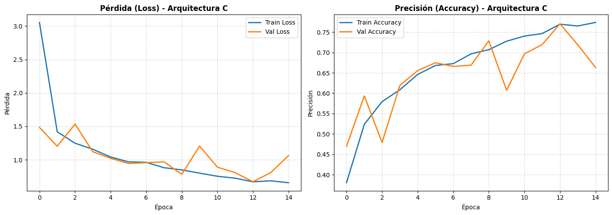
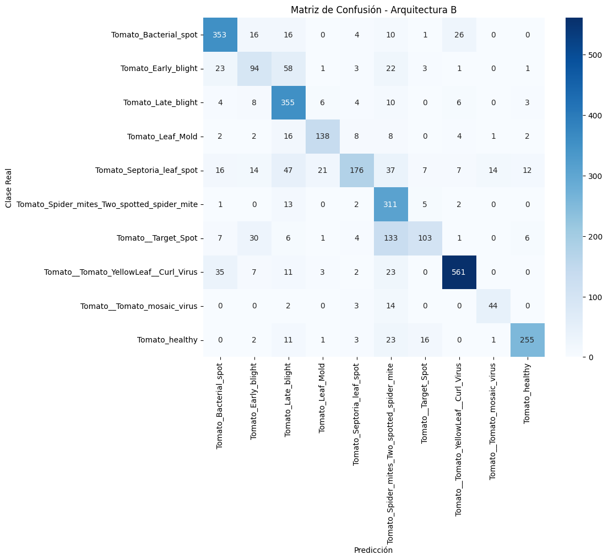

# Evaluación Parcial 1: Sistema Especializado de Patologías en Tomate

**Asignatura:** Técnicas Avanzadas de Machine Learning (TLY1102)

**Sección:** 001D

**Integrantes:** Matías Gutiérrez, David Larenas, Victor Mena


## 1. Descripción del Problema de Negocio

El sector agrícola enfrenta pérdidas significativas en la producción de tomate debido al diagnóstico tardío o incorrecto de enfermedades foliares. Los métodos tradicionales dependen de la inspección visual humana, un proceso lento, costoso y propenso a errores sistemáticos cuando las enfermedades comparten síntomas similares (como los diferentes tipos de tizón).

Para solucionar esta problemática, se plantea el desarrollo de un sistema computacional basado en Inteligencia Artificial capaz de clasificar de forma automatizada 10 estados de salud en hojas de tomate (9 patologías y 1 estado sano). Al concentrar el vector de características únicamente en el cultivo de tomate y descartar especies de ruido (como papa o pimentón), la red neuronal optimiza la extracción de patrones finos en las hojas.


## 2. Objetivos del Proyecto

* **Objetivo General:** Implementar y comparar tres arquitecturas de Perceptrón Multicapa (MLP) en TensorFlow/Keras para la clasificación automatizada de enfermedades en hojas de tomate a partir del dataset *PlantVillage*.
* **Objetivos Específicos:**
1. Construir un pipeline de datos optimizado que aplique filtrado de variante, reescalado de intensidad ($1/255$) y división balanceada ($80/20$).
2. Entrenar y evaluar tres arquitecturas con distinta capacidad vectorial para evidenciar experimentalmente los fenómenos de *Underfitting*, desempaño óptimo y *Overfitting*.
3. Diagnosticar el impacto del desbalance de clases mediante matrices de confusión y reportes de clasificación ($Precision$, $Recall$, $F1\text{-}Score$).


## 3. Indicadores Clave de Rendimiento (KPIs)

* **KPI 1 (Precisión Global):** Alcanzar una exactitud ($Accuracy$) mayor al 70% en el conjunto de validación sobre el modelo final.
* **KPI 2 (Detección de Planta Sana):** Obtener un $F1\text{-}Score \ge 0.85$ en la clase `Tomato_healthy` para evitar falsas alarmas y tratamientos innecesarios.
* **KPI 3 (Cobertura de Clases Escasas):** Lograr un $F1\text{-}Score \ge 0.70$ en patologías minoritarias como `Tomato_mosaic_virus`.
* **KPI 4 (Eficiencia Operativa):** Mantener un tiempo de inferencia inferior a 100 ms por imagen para permitir diagnósticos en tiempo real.


## 4. Descripción de las Fuentes de Datos

Se utiliza el conjunto de datos público **PlantVillage**, filtrado para conformar una variante exclusiva del cultivo de tomate:

* **Volumen Total:** 16,008 imágenes RGB estandarizadas a $128 \times 128$ píxeles.
* **Número de Clases:** 10 categorías (1 sana y 9 patologías).
* **División de Datos:** 80% entrenamiento (12,806 muestras) y 20% validación (3,202 muestras), fijados con semilla aleatoria `123`.



## 5. Metodología Utilizada (CRISP-DM)

El desarrollo del proyecto se estructuró conforme al marco de trabajo **CRISP-DM**:


1. **Comprensión del Negocio:** Definición de requerimientos agrícolas y acotamiento del alcance a la variante de tomate.
2. **Comprensión de Datos:** Inspección de resoluciones, canales de color y distribución de categorías.
3. **Preparación de Datos:** Redimensionamiento, normalización mediante `Rescaling(1./255)` y vectorizado (`Flatten`).
4. **Modelado:** Diseño e implementación de arquitecturas A, B y C con optimizador Adam y función de pérdida `sparse_categorical_crossentropy`.
5. **Evaluación:** Comparación de métricas absolutas, trazado de curvas de aprendizaje e identificación de confusiones visuales.
6. **Despliegue/Reproducibilidad:** Estructuración del repositorio profesional y empaquetado del notebook.

## 6. Preparación y Análisis Exploratorio de Datos (EDA)

### Distribución de Clases y Desbalance

El análisis del conjunto de entrenamiento evidencia una fuerte disparidad en la frecuencia de las muestras:

* **Clase Mayoritaria:** `Tomato__Tomato_YellowLeaf__Curl_Virus` representa la clase dominante con más de 2,500 imágenes.
* **Clase Minoritaria:** `Tomato__Tomato_mosaic_virus` cuenta únicamente con ~300 imágenes (relación 8:1).
* **Distribución Intermedia:** Las 8 clases restantes fluctúan entre 800 y 1,700 imágenes.




## 7. Modelado y Entrenamiento

Se evaluaron tres configuraciones de Redes Neuronales Densas (MLP) sobre una entrada aplanada de **49,152 características** ($128 \times 128 \times 3$):

| Modelo | Capas Ocultas | Neuronas por Capa | Parámetros Totales | Comportamiento Esperado |
| --- | --- | --- | --- | --- |
| **Arquitectura A** | 1 | 64 | 3,146,442 | Underfitting Severo |
| **Arquitectura B** | 3 | 512 / 256 / 128 | 25,317,386 | **Desempeño Óptimo (Ganador)** |
| **Arquitectura C** | 2 | 256 / 128 | 12,618,378 | Overfitting Tardío |

### Parámetros de Compilación

* **Optimizador:** Adam (`learning_rate=0.001` por defecto).
* **Función de Pérdida:** `sparse_categorical_crossentropy`.
* **Épocas:** 15.
* **Tamaño de Lote (Batch Size):** 32.

## 8. Evaluación y Resultados

### Comparativa General de Modelos

| Arquitectura | Pérdida Entrenamiento | Precisión Entrenamiento | Pérdida Validación | Precisión Validación | Diagnóstico Técnico |
| --- | --- | --- | --- | --- | --- |
| **Modelo A** | 2.1969 | 20.03% | 2.1892 | 10.52% | Cuello de botella vectorial (*Underfitting*) |
| **Modelo B** | **0.5961** | **79.51%** | **0.7449** | **74.64%** | **Capacidad balanceada (Seleccionado)** |
| **Modelo C** | 0.6556 | 77.39% | 1.0620 | 66.30% | Memorización en época 12+ (*Overfitting*) |

### Graficos de Rendimiento

#### Arquitectura A


#### Arquitectura B


#### Arquitectura C


### Análisis de Desempeño del Modelo B (Mejor)

#### Reporte de Clasificación

```
                                             precision    recall  f1-score   support

                      Tomato_Bacterial_spot       0.80      0.83      0.81       426
                        Tomato_Early_blight       0.54      0.46      0.50       206
                         Tomato_Late_blight       0.66      0.90      0.76       396
                           Tomato_Leaf_Mold       0.81      0.76      0.78       181
                  Tomato_Septoria_leaf_spot       0.84      0.50      0.63       351
Tomato_Spider_mites_Two_spotted_spider_mite       0.53      0.93      0.67       334
                        Tomato__Target_Spot       0.76      0.35      0.48       291
      Tomato__Tomato_YellowLeaf__Curl_Virus       0.92      0.87      0.90       642
                Tomato__Tomato_mosaic_virus       0.73      0.70      0.72        63
                             Tomato_healthy       0.91      0.82      0.86       312

                                   accuracy                           0.75      3202
                                  macro avg       0.75      0.71      0.71      3202
                               weighted avg       0.77      0.75      0.74      3202

```

#### Matriz de Confusión



### Hallazgos Principales

1. **Cumplimiento de KPIs:** Se alcanzaron los objetivos clave con un **Accuracy del 74.64%** (KPI 1), un **F1-Score de 0.86 en la clase sana** (KPI 2) y un **F1-Score de 0.72 en la clase minoritaria** `mosaic_virus` (KPI 3).
2. **Confusiones Visuales Críticas:** La matriz de confusión reveló que 133 muestras de `Target_Spot` fueron clasificadas como `Spider_mite`. Asimismo, existió un solapamiento leve entre `Early_blight` y `Late_blight`.
